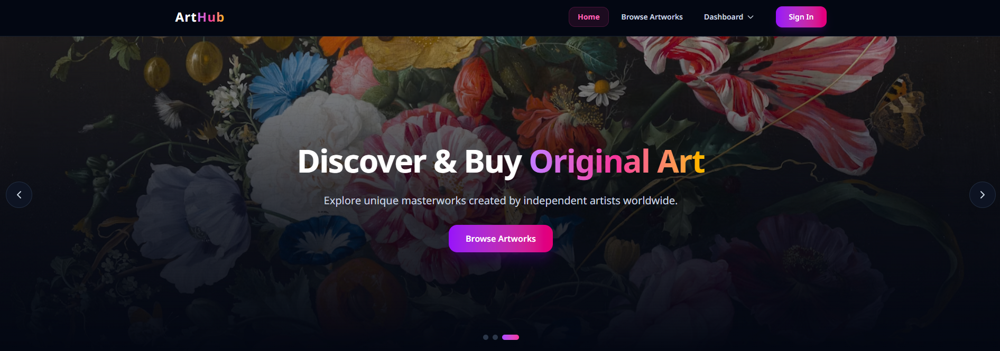
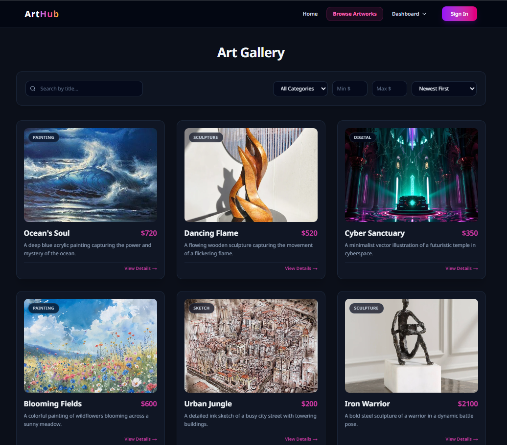
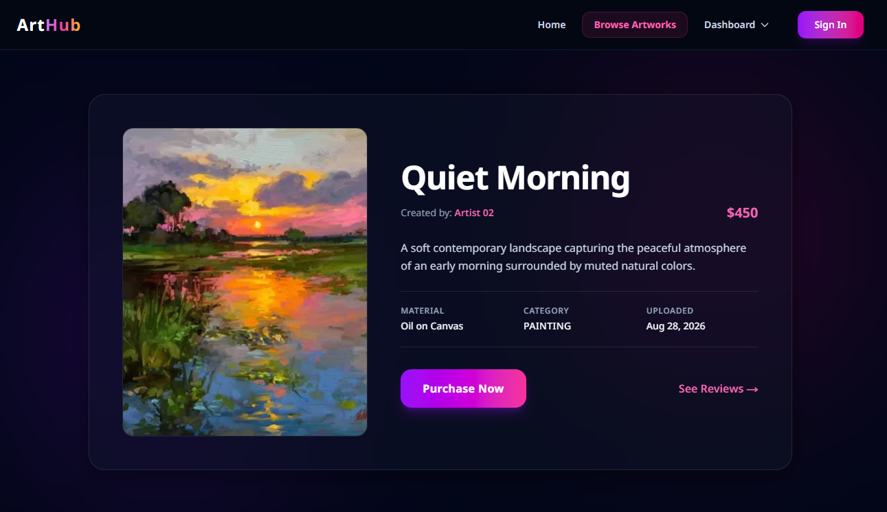
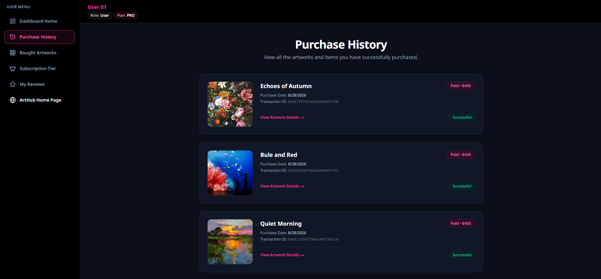
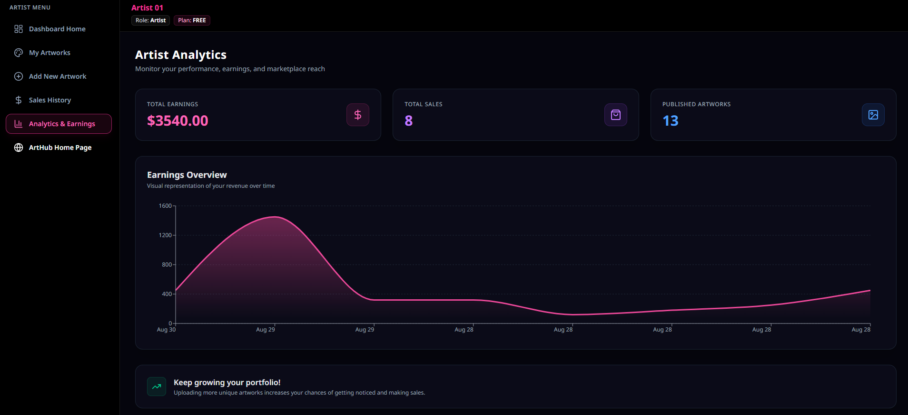
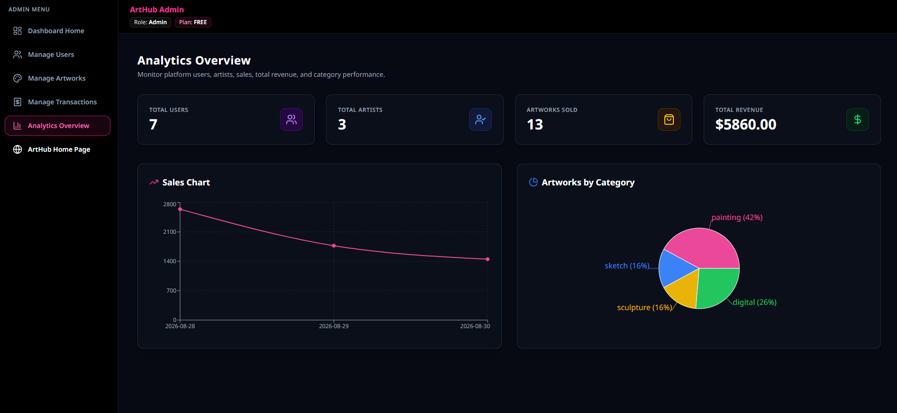

# 🎨 ArtHub - Online Art Marketplace

ArtHub is a full-stack digital platform designed to connect art lovers, collectors, and buyers with talented artists, enabling them to discover and purchase original artworks seamlessly.

---

## 📸 Screenshots

| Home Page | Browse Artworks |
| :---: | :---: |
|  |  |

| Artwork Details | User Dashboard |
| :---: | :---: |
|  |  |

| Artist Dashboard | Admin Dashboard |
| :---: | :---: |
|  |  |

---

## 🚀 Tech Stack

- **Frontend:** Next.js (App Router, Tailwind CSS, Framer Motion)
- **Backend:** Node.js, Express.js
- **Database:** MongoDB
- **Authentication:** Better Auth (Email/Password & Google OAuth)
- **Storage & Payments:** imgBB API & Stripe Checkout

---

## ✨ Key Features

- **Multi-Role User System:** Separate dashboards and permissions for Users (Buyers), Artists, and Admins.
- **Advanced Browse & Search:** Search artworks by title/artist, filter by categories and price ranges, sort by price/date, and smooth pagination.
- **Interactive Reviews & Comments:** Commenting system on artwork after succesfull payment.
- **Stripe Subscriptions & Purchases:** Secure tier-based subscriptions (Free, Pro, Premium) and artwork purchasing with purchase limit validations.
- **Admin Management & Analytics:** Full control over users (role changes), all artworks, platform transactions, and visual sales/revenue analytics.

---

## 🌐 Live Links & Repositories

- **Live Site URL:** https://arthub-shop-client.vercel.app/
- **Frontend Repository:** https://github.com/wdev-jahidhasan/arthub-client
- **Backend Repository:** https://github.com/wdev-jahidhasan/arthub-server

---